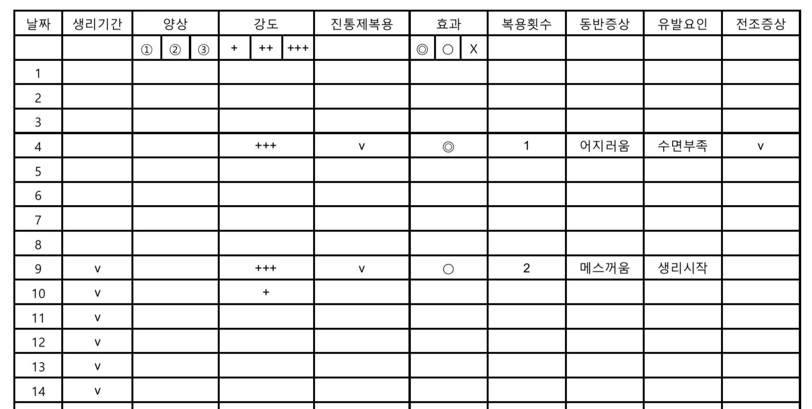

\cleardoublepage

# (APPENDIX) Appendix {-}

# 두통 일기

두통일기는 임상의사가 환자의 치료반응을 평가하는데 있어서 매우 유용하며, 환자가 스스로 본인의 두통 패턴을 파악하고 유발인자를 회피하도록 돕는 교육적 효과도 있다. 따라서 예방치료를 고려하는 환자에게는 필수적이며, 가능하다면 모든 편두통환자에게 적용하는 것이 좋다. 

두통일기는 두통이 발생하였을 때 증상 및 유발인자 등을 기록하고, 두통이 멈춘 후에 두통의 완화요인, 급성기약물복용 여부 및 치료반응, 두통의 지속시간 등을 전향적으로 기록하는 것이 이상적이다. 그러나 현실적으로는 두통발작 중에 기록지를 작성하는 것이 어려우므로, 매일 취침 전에 그날의 두통 여부에 대해서 후향적으로 기록하도록 하는 방법을 사용할 수 있다. 두통이 잦거나 만성편두통인 경우 이 방법이 특히 권장된다.

일반적으로 임상현장에서 사용되는 일기의 경우 필수적인 항목은 다음과 같다.

- 두통의 강도 (경도/중등도/심도): 경도의 두통이란 두통으로 인해 일상생활에 영향을 받지 않는 정도의 두통, 심도의 두통은 두통이 너무 심해 일상생활을 전혀 할 수 없는 정도의 두통을 의미하며, 중등도의 두통은 그 중간을 의미한다. 만성편두통 환자의 경우 경도의 지속성 두통을 기록하지 않는 경우가 많으나, 환자가 머리가 맑지 않은 날에는 경도의 두통이 지속되고 있을 가능성이 높으므로 이것 또한 기록하도록 교육해야 한다. 편두통삽화가 2일 이상 지속된 경우 각각의 날짜에 대해서 모두 기록한다.

- 급성기약물 (복용여부/종류/용량/효과): 복용 후 2시간째에 효과를 판정하도록 교육한다. 완전호전, 부분호전, 무반응으로 나누어 기록하고, 부분호전 및 무반응시의 대응책을 담당의가 사전에 결정하여 교육하는 것이 좋다. 

- 유발요인: 당일 또는 전일의 특별한 사건, 생활습관의 변화, 특정한 음식의 섭취 등을 기록하도록 한다.

- (여성의 경우) 생리주기: 두통여부와 상관없이 월경이 일어난 모든 날에 표시하도록 한다.

이외에도 임상상황에 따라 항목을 추가하거나 삭제할 수 있다. 삼차자율신경두통과의 감별진단 등 특수한 목적이 있거나, 여러 가지 두통 양상이 혼재된 환자의 경우 두통발생시각, 두통의 양상, 동반증상 (구역, 구토, 자율신경증상 등), 두통의 위치 등을 필요에 따라 추가하여 기록하도록 교육할 수 있다.

종이로 된 두통일지 또는 모바일 어플리케이션을 사용할 수 있다. 모바일 어플리케이션은 대한두통학회 홈페이지 (www.headache.or.kr) 에서 다운로드 가능하다. 

 
