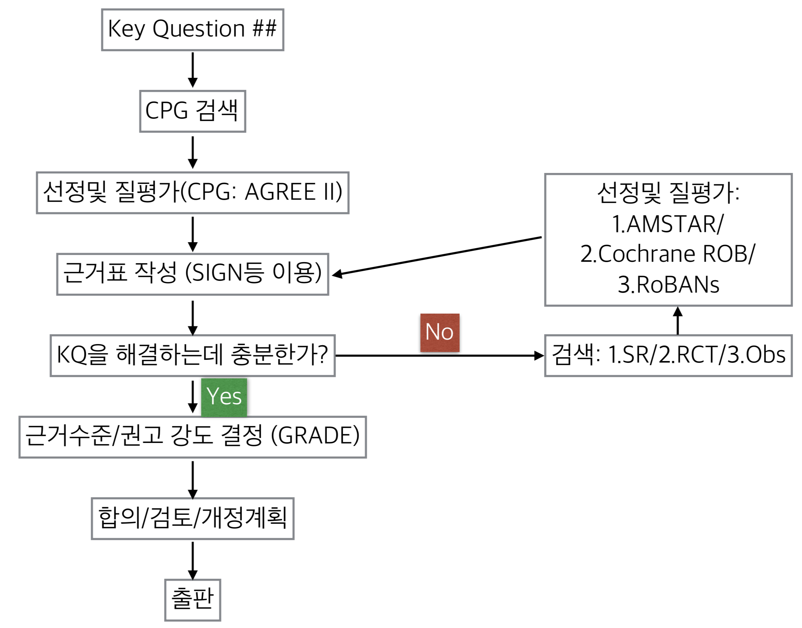

# 개발의 엄격성

## 개발방법
- **Adaptation**
  + 2012 - 2017년까지의 진료지침 + 2012-2017년 사이 연구를 핵심질문별로 다시 검색
  + 그외 수기로 논문 추가 조사 (논문의 참고문헌등)
    
## 지침및 근거검색  

<!-- 
 -->
<!--  -->
<!-- 
 -->

- 진료지침검색 
  + 정보원
    - National guideline clearinghouse 
    - Guideline international network 
    - Pubmed
    - Google search
    - KoMGI
    - KoreaMed - KMBASE
    
  <!-- + 선택기준  -->
  <!--   - From 2012 to 2016 -->
  <!--   – Written in English or Korean  -->
  <!--   – By Multi-disciplinary team -->
  <!--   – Evidence-based method -->

  <!-- + 9개의 진료지침 검토 -->

  <!--   – 2012 AAN AHS guideline update for migraine prophylaxis Neurology (김병수, 정필욱) -->
  <!--   – 2012 Canadian guideline for migraine prophylaxis Can J neurol sci (이미지, 손종희)  -->
  <!--   – 2012 Croatia guideline (송태진, 손종희)  -->
  <!--   – 2012 Danish Guidelines JHP (서종근, 최윤주)  -->
  <!--   – 2012 French guidelines revised JHP (정필욱, 김병수)  -->
  <!--   – 2012 Italian Guidelines revised version  -->
  <!--   -JHP supple (최윤주, 서종근)  -->
  <!--   – ICSI guideline 2013 (original version, full-text) (송태진, 김병수)  -->
  <!--   – NICE guideline for headache in over 12s (2012) (2015 update) (이미지, 김병건)  -->
  <!--   – Practice guideline update summary for Botulinum neurotoxin (AAN) 2016 neurology (이미지) -->

- 근거검색
  + 검색원 
    - 전자문헌검색: 상기 + Ovid DB(MEDLINE/EMBASE) Cochrane library
    - 수기검색 (gray literature)
    
- 검색 결과
  + [최신성 검색](static/SearchingResult_ 201710.pdf): online only material
    - 2012-2017년 10월까지 검색어, 검색결과 

## 검색된 진료지침및 연구결과 선별
- 선정 기준
  + 핵실질문과 일치하는 PICO를 포함
  + 동료검토가 이루어 진것 
  + 한국어 또는 영어로 출판된 것
  + 근거기반 방법론을 사용한 것
  + 2012년 이후 출판

## 검색된 진료지침및 연구결과 평가 
- 진료지침은 AGREE-II를 이용하여 평가.
- 진료지침만으로 핵심질문을 답하는데 충분하지 않으면 체계적 문헌고찰, 무작위비교임상시험, 관찰연구등 순으로 추가 자료에 대해 질평가를 시행하고 근거표를 작성하였음.

## 권고문 합의및 권고등급 결정
### 근거수준과 권고등급의 평가: GRADE 방식 사용 {-}
#### 근거수준 {-}
근거수준(level of evidence)는 현재까지의 근거를 바탕으로 특정 중재의 효과에 대해 확신하는 정도를 말한다. 

본 지침에서는 GRADE방식을 수정차용하여 아래와 같이 평가하였다.

- **높음**: 추정된 효과가 실제효과와 비슷할 것이라고 매우 확신한다.
- **보통**: 추정된 효과가 실제 효과와 근접할 것이라고 확인한다. 하지만 상당히 다를 수 있는 가능성도 있다.
- **낮음**: 추정된 효과는 실제효과와 아마도 상당히 다를지 모른다.
- **매우 낮음**: 추정된 효과는 실제효과에 상당히 다를 가능성이 있다.
- **전문가 의견**: 기존 근거가 별로 없으나 본 위원회 전문가의 공식적 합의 절차를 거쳐 현재 수준에서 임상적 적용을 하기에 적절함.

#### 권고등급 {-}
권고등급(strength of recommendation)ʼ이란
권고 대상 환자에게 해당 중재를 시행하였을 때 위해(harm)보다 이득 (benefit)이 더 클 것으로 혹은 작을 것으로 확신하는 정도를 말한다.
권고등급은 일반적으로

1. 근거수준,
2. 효과 크기(이득과 위해의 저울질)
3. 가치와 선호도,
4. 자원이용(비용)

의 네 가지를 고려하여 결정한다.

본 지침에서는 Tools for GRADE를 사용하여 아래와 같이 평가하였다. 

- **Strong for**: 강하게 권고, "사용하는 것을 권고한다."
- **Weak for**: 약하게 권고, "사용하는 것을 고려할 수 있다."
- **Weak against**: 약하게 권고하지 않음, "사용하지 않을 것을 제안한다."
- **Strong against**: 강하게 권고하지 않음, "사용하지 않을 것을 권고한다."

